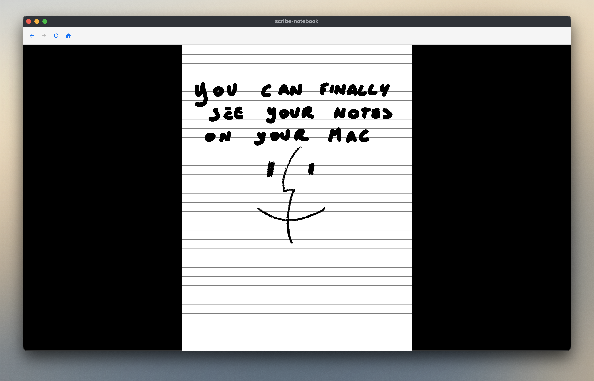
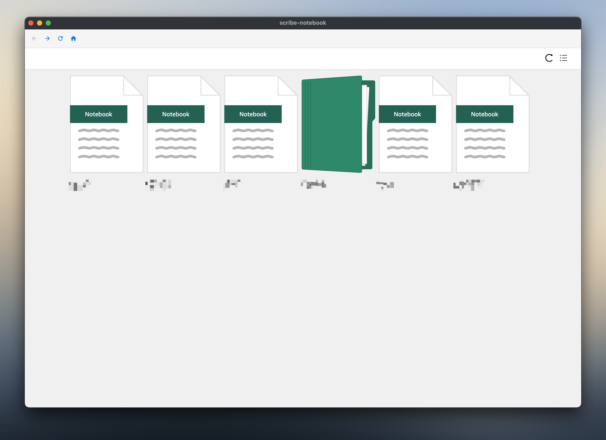

# Scribe Notebooks
A lightweight desktop application wrapper for Kindle Notebook, enabling seamless access to your Kindle Scribe notebooks.





## Download

Download the latest release from the [Releases page](https://github.com/jacopom/scribe-notebooks/releases/latest).

Grab the `.dmg` file, open it, and drag **Scribe Notebook** to your Applications folder.

### "Scribe Notebook is damaged" / "Apple could not verify this app" — Gatekeeper bypass

Because the app is not notarized with an Apple Developer certificate, macOS will block it on first launch. You may see either _"is damaged and can't be opened"_ or _"cannot verify that this app is free from malware"_ — both are the same Gatekeeper quarantine and have the same fix.

**Option 1 — Terminal (quickest):**

```bash
xattr -cr /Applications/Scribe\ Notebook.app
```

Then open the app normally.

**Option 2 — System Settings:**

1. Try to open the app — macOS will show the warning dialog. Click **Cancel** (or **Done**).
2. Open **System Settings → Privacy & Security**.
3. Scroll down to the **Security** section. You'll see a message like _"Scribe Notebook was blocked…"_ with an **Open Anyway** button.
4. Click **Open Anyway**, then confirm in the dialog that appears.

You only need to do this once.

---

## Features
- 🌐 Direct access to Kindle Notebook web interface
- 💻 Cross-platform desktop experience
- 🔒 Persistent login session
- 🖥️ Minimal, distraction-free interface

## Development

### Prerequisites
- Node.js 18+ 
- npm 9+
- Git

### Setup
1. Clone the repository
```bash
git clone git@github.com:jacopom/scribe-notebooks.git
cd scribe-notebooks
```

2. Install dependencies
```bash
npm install
```

3. Development Mode
```bash
npm run dev
```

### Building
Create production builds for different platforms:

#### Mac
```bash
npm run build:mac
```

#### Windows
```bash
npm run build:win
```

#### Linux
```bash
npm run build:linux
```


## Signing In

When you first open the app, you'll see a welcome screen. Click **Sign in to Amazon** to open Amazon's official login page in a secure popup window.

**Your credentials stay completely private.** The app never intercepts your password, passkey, or account details — everything goes directly to Amazon's servers. Once you're signed in, the popup closes automatically and your notes load immediately.

### Session persistence

Your login session is saved locally and persists between app restarts, so you only need to sign in once.

### Passkey / Bitwarden users

If your Amazon account uses a passkey stored in a browser extension (like Bitwarden), note that browser extensions are not available inside the Electron login popup. You have two options:

1. **Use a recovery code** — Amazon lets you sign in with a one-time recovery code from your account security settings, which bypasses passkeys entirely.
2. **Reset to password** — Temporarily add a regular password to your Amazon account, sign in once, then re-secure it however you prefer.

After signing in once, the session persists and you won't need to repeat this.

---

## License
[MIT License](LICENSE)

## Disclaimer
This application is an unofficial wrapper and is not affiliated with Amazon or Kindle.
